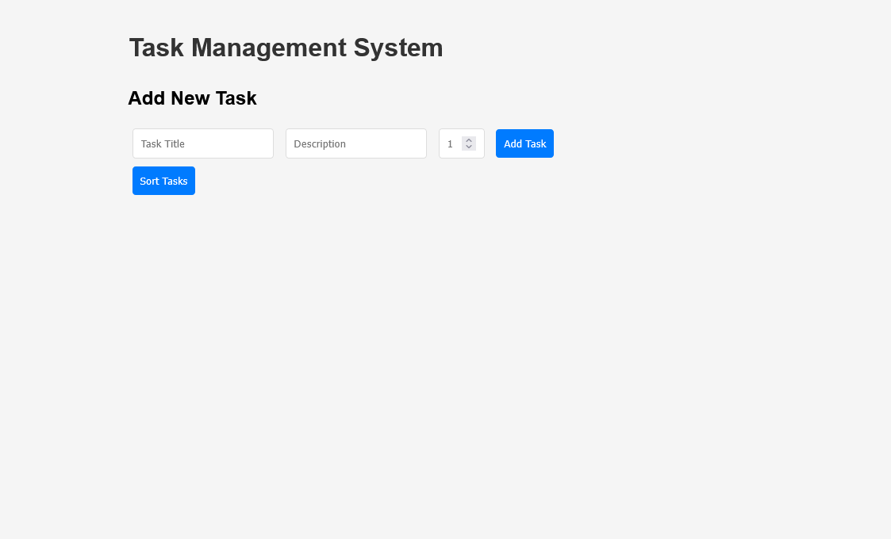
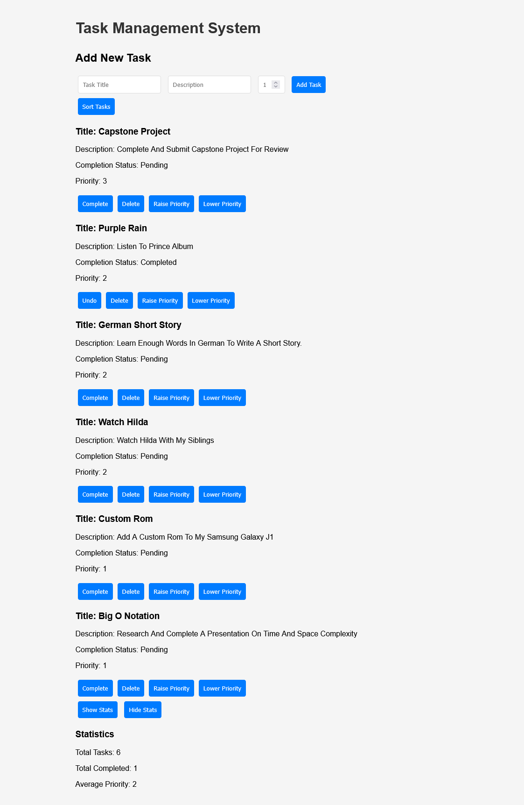
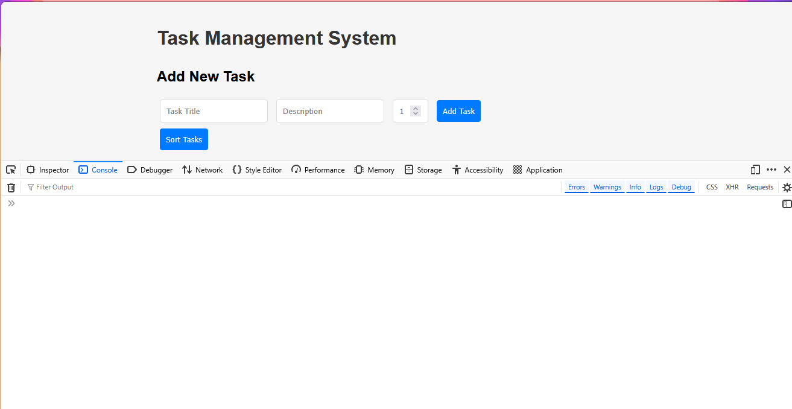
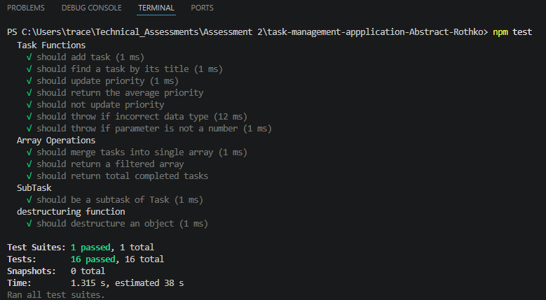

[](https://classroom.github.com/online_ide?assignment_repo_id=24133082&assignment_repo_type=AssignmentRepo)
# Task Manager - JavaScript Starter Code

This is the starter codebase for your JavaScript task management application. The code is approximately 70% complete but contains errors, omissions, and areas that need significant improvement.

---
## How to set up project

### 1. Clone the Repo
```bash
gh repo clone Umuzi-skillslab/task-management-appplication-Abstract-Rothko
```

### 2. Choose the correct directory
```bash
cd complete-website-Abstract-Rothko
```

### 3. Run tests
```
npm tests
```

### 4. Run `index.html` to view the Home Page

#### No special requirements

---

## Project Structure
 
```bash
task-manager/
│
├── src/
│ ├── app.js
│ ├── dom.js
│ └── utils.js
│
├── tests/
│ └── app.test.js
│
├── index.html
├── styles.css
├── package.json
├── .gitignore
├── issues-identified.pdf
├── screenshots/
│ ├── app-running.png
│ ├── tests-passing.png
│ ├── console-no-errors.png
│ └── features-working.png
│
└── README.md

```

---

## General:
- `var` keyword is used instead of `let` or `const`. Updated the keyword to either `let` or `const` depending on the use case.
- Some variables were declared without a keyword. Added `let` or `const` to fix.
- Some conditionals contained the wrong equality operator, using loose equality instead of strict equality. Refactored to only use strict equality.

## File: index.html:

- Add input for priority input
Change type of js files to module
- Add  button to sort tasks
- Add buttons to show and hide stats


## File: app.js:
- Import `generateRandomId` from utils
- Add `id` property to `Task` class and assign `generateRandomId` function to it
- Added `toggleCompletion` method to update completed property, alternating between true and false.
- Refactor `getInfo` method to return string literal instead of string concatenation.
- Added `super()` method to SubTask constructor for proper inheritance.
- Function had a for loop that had more iterations than what the array contained. Implemented a for-of loop to prevent future error.
- Added the missing parameter to function.
- while loop did not have an increment. Added increment.
- Refactored function `getTaskDetails` to make use of object destructuring.
- Implemented rest parameter and spread operator in `mergeTasks` function.
- Implemented a null check in `calculateAveragePriority`. Also added Math.round to round up the return value.
- Refactor `getHighPriorityTasks` function to make use of the filter method in order to follow the functional programming paradigm.
- Added type safety checks to the parameters of the function `updateTaskPriority`
- Added base case to the recursive function `countCompletedTasks`. Added type safety checks for parameters as well.
- Implemented check for empty array in `calculateAveragePriority` function. Refactored for loop to use the modern for-of loop.
- Add methods to Task Manager using the functional approach
- Add `export` keyword and all related functions and classes are added

## File: dom.js:

- Change all string concatenation to template literals
- Use `DOMContentLoaded` to call setupEventListeners.
- Fixed `getElementById` by correctly assign id
- Fixed `querySelector` to include id selector
- Added `event.preventDefault()`
- Added `this.reset()`
- Added while loop to clear content upon reload and then load the necessary content from memory
- Change `innerHTML` to `insertAdjacentHTML`
- Import from app.js and utils.js
- Add validation checks for received inputs
- Add null checks for event listeners
- Added buttons with necessary functionality and proper event delegation

## File: utils.js:

- Update `generateRandomId` function to return an integer instead of a floating point number.
- `isHighPriority` function is fixed to return boolean value.
- `isMediumPriority` and `isLowPriority` functions are added that serve a similar purpose to `isHighPriority`.
- `formatTaskName` function is fixed to return a string that is trimmed and capitalized.
- `formathTaskPriority` function is added to format the priority property to return value that is type number.
- Updated `saveToStorage` and `loadFromStorage` functions to use `JSON.stringify()` and `JSON.parse()` to better store and retrieve data. Wrap the logic in try-catch blocks since the operations can be considered risky.
- Change priorities data structure from an array to an object
- Add `export` keyword and all related functions and classes are added

## Screenshots

### Application Running in Browser


### Features Working


### Console Showing no Errors


### Tests Passing


---

## Lessons Learnt

This project has made my realize that there is a lot that I need to still be learning. From how to handle the DOM, to how to manage data, and managing my own time for these projects.